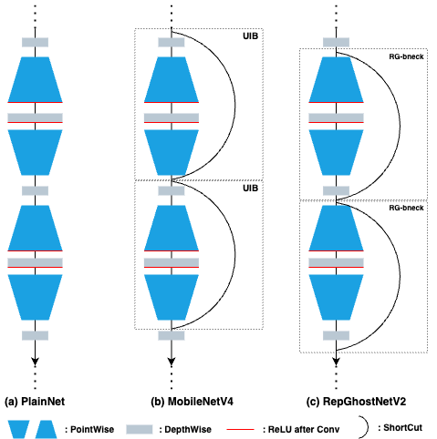

## RepGhostNetV2: When RepGhost meets MobileNetV4

Inspired by Universal Inverted Bottleneck (UIB) in MobileNetV4, we build our RepGhostNetV2 by utilizing RepGhost bottleneck from [RepGhost](https://arxiv.org/abs/2211.06088).
As shown in the Figure blow, RepGhostNetV2 differs to MobileNetV4 only in the shortcut connections.

The shortcut connections greatly facilitate the optimizations of CNNs, and even not affect the latency.
It is worth benchmarking its key role in light-weight CNNs. And more variants may be possible.

<p align="center">

</p>


### Training
We directly use the training settings from [RepGhost repo](https://github.com/ChengpengChen/RepGhost) to evaluate their performances. Refer to ```train.sh``` for more training details.
Re-parameterization is not applied here during training.


### Results
The latency are evaluated on an iPhone12 based on [ModelBench](https://github.com/apple/ml-mobileone/tree/main/ModelBench).

| Model   | Size | Params     | FLOPs         | Latency(ms) | Top-1 Acc.(%) |
|:--------|:-----|:-----------|:--------------|:------------|:--------------|
| RGv2-S  | 224  | 3,772,744  | 186,006,848   | 1.01        | 72.3          |
| MNv4-S  | 224  | 3,772,744  | 186,006,848   | 1.01        | 72.3          |
| RGv2-M  | 256  | 9,714,232  | 1,080,245,504 | 1.48        | 79.5          |
| MNv4-M  | 256  | 9,714,232  | 1,080,245,504 | 1.48        | 79.5          |
| RGv2-L  | 384  | 32,589,584 | 6,376,221,952 | 3.63        | 81.5          |
| MNv4-L  | 384  | 32,589,584 | 6,376,221,952 | 3.63        | 81.5          |

### TODO
- [ ] Tune the training setting to reproduce results of MobileNetV4.
- [ ] Release checkpoints.
- [ ] Support Mobile MQA attention block.
- [ ] More variants of shortcut connections in light-weight CNNs.


### Citations
If RepGhostNetV2 helps your research or work, please consider citing:

```
@misc{chen2024repghostnetv2,
  author = {Chengpeng Chen},
  title = {RepGhostNetV2: When RepGhost Meets MobileNetV4},
  year = {2024},
  publisher = {GitHub},
  journal = {GitHub repository},
  url = {https://github.com/ChengpengChen/RepGhostNetV2},
}
```


### Contact

If you have any questions, please contact chencp@live.com.

---
